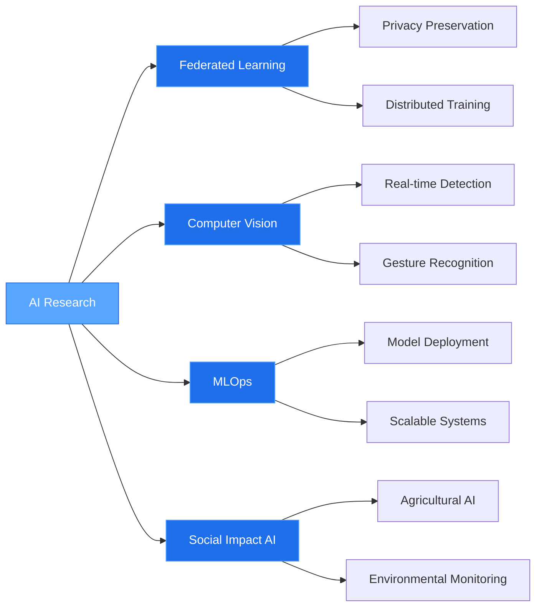
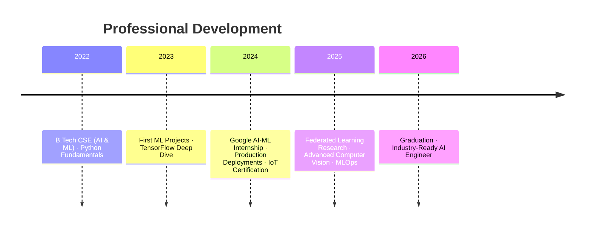

<div align="center">


[](https://github.com/karthikredddy7github)
[](https://github.com/karthikredddy7github?tab=followers)
[](https://github.com/karthikredddy7github)

</div>

---

## PROFILE

<table>
<tr>
<td width="50%" valign="top">

**EDUCATION**
```
B.Tech Computer Science
AI & ML Specialization
RISE Krishna Sai Prakasam Group
CGPA: 9.15/10
Expected: June 2026
```

**LOCATION**
```
Ongole, Andhra Pradesh
India
```

</td>
<td width="50%" valign="top">

**EXPERTISE**
```yaml
Primary:
  - Federated Learning
  - Deep Neural Networks
  - Computer Vision
  - Privacy-Preserving AI
  
Secondary:
  - MLOps & Deployment
  - Socket Programming
  - Transfer Learning
  - AI Agent Development
```

</td>
</tr>
</table>

**CURRENT FOCUS**

Building privacy-preserving distributed machine learning systems for real-world applications. Specializing in federated learning architectures, end-to-end ML deployment, and AI solutions with measurable social impact.

---

## RESEARCH & PROJECTS

### **Flood Forecasting via Federated Learning**
[View Repository →](https://github.com/karthikredddy7github/Flood_Forecasting_Model_using_Federated-Learning)

```
ARCHITECTURE    Distributed Deep Learning System
INNOVATION      Privacy-preserving hydrological forecasting
IMPLEMENTATION  3 monitoring stations + central aggregation server
MODELS          FFNN (baseline) | CNN-2D (advanced)
METRICS         R² > 0.90 | 100% data locality preserved
STACK           TensorFlow · Keras · Python Sockets · CustomTkinter
PROTOCOL        TCP/IP socket-based communication (Port 2222)
ALGORITHM       Federated Averaging (FedAvg)
```

**Technical Contributions**
- Implemented distributed training across geographically separated nodes
- Designed socket-based model aggregation protocol
- Achieved high accuracy while maintaining complete data privacy
- Built real-time monitoring dashboards with live metrics

---

### **Computer Vision: Gesture-Based Interface**
[View Repository →](https://github.com/karthikredddy7github/FunDraw_ChemLab)

```
DOMAIN          Computer Vision · Human-Computer Interaction
TECHNOLOGY      MediaPipe · OpenCV · Real-time Hand Tracking
FEATURES        Virtual painting | Chemistry lab simulations
CAPABILITIES    21-landmark hand detection · Gesture recognition
APPLICATION     Educational technology · Accessibility tools
```

**Innovation**
Touchless interface leveraging webcam input for air-based drawing and interactive virtual experiments. No specialized hardware required.

---

### **Agricultural AI: Poultry Disease Detection**
[View Repository →](https://github.com/karthikredddy7github/Poultry_disease_detect-AI)

```
PROBLEM         Early disease detection in rural farming
SOLUTION        CNN-based classification system
DETECTION       Coccidiosis | Newcastle Disease | Salmonella
DEPLOYMENT      Web application (Flask)
IMPACT          Early intervention for livestock health
TARGET          Rural farmers with limited veterinary access
```

---

### **Textile Industry: Pattern Classification**
[View Repository →](https://github.com/karthikredddy7github/pattern_sense)

```
APPROACH        Transfer Learning (MobileNetV2)
CATEGORIES      10 fabric patterns
                Animal | Cartoon | Floral | Geometry | Ikat
                Plain | Polka Dot | Squares | Stripes | Tribal
USE CASE        Fashion industry automation
BENEFIT         Accelerated design workflows · Inventory management
```

---

## TECHNICAL STACK

**Machine Learning & AI**
```
Core        TensorFlow · Keras · Scikit-Learn
Vision      OpenCV · MediaPipe
Data        NumPy · Pandas · Matplotlib
```

**Development**
```
Languages   Python · Java · C · SQL
Web         Flask · HTML5 · CSS3 · JavaScript
Tools       Git · GitHub · VS Code · Jupyter · Colab · Anaconda
```

**Specialized**
```
Federated Learning  ████████████████░░  Advanced
Socket Programming  ████████████████░░  Advanced  
Computer Vision     ██████████████████  Expert
Transfer Learning   ████████████████░░  Advanced
Model Deployment    ██████████████░░░░  Proficient
```

**AI Tools**
```
Antigravity     Google DeepMind AI coding assistant
n8n             AI agent workflow automation
ChatGPT         Prompt engineering
```

---

## ANALYTICS

<div align="center">


</div>

---

## CERTIFICATIONS

| Certification | Organization | Year | Domain |
|:---|:---|:---:|:---|
| Google AI-ML Virtual Internship | EduSkills | 2024 | Machine Learning |
| TECH CAMP on Google AI-ML | EduSkills | 2024 | Deep Learning |
| Introduction to IoT | NPTEL | 2024 | IoT Systems |
| Prompt Engineering & ChatGPT | ExcelR & APSCHE | 2024 | Generative AI |

---

## RESEARCH INTERESTS



**Current Research Focus**
- Privacy-preserving distributed machine learning architectures
- Real-time computer vision for human-computer interaction
- Scalable model deployment and monitoring systems
- AI applications for environmental and agricultural challenges

---

## CAREER TIMELINE



---

## OPPORTUNITIES

Currently seeking opportunities in:

```
POSITIONS       Graduate roles in AI/ML Engineering
                Research internships in Federated Learning
                Full-time Deep Learning & Computer Vision positions
                
COLLABORATION   Privacy-preserving AI research
                Open-source ML projects
                Social impact AI initiatives
```

---

## CONTACT

<div align="center">

[](mailto:karthikreddym4253@gmail.com)
[](https://github.com/karthikredddy7github)
[](https://leetcode.com/u/Karthik_reddy_manchala)

</div>

---

<div align="center">

### PROJECTS: 7+ | LINES OF CODE: 10K+ | RESEARCH HOURS: 500+

<sub>Building the future of privacy-preserving AI, one distributed system at a time.</sub>


</div>
