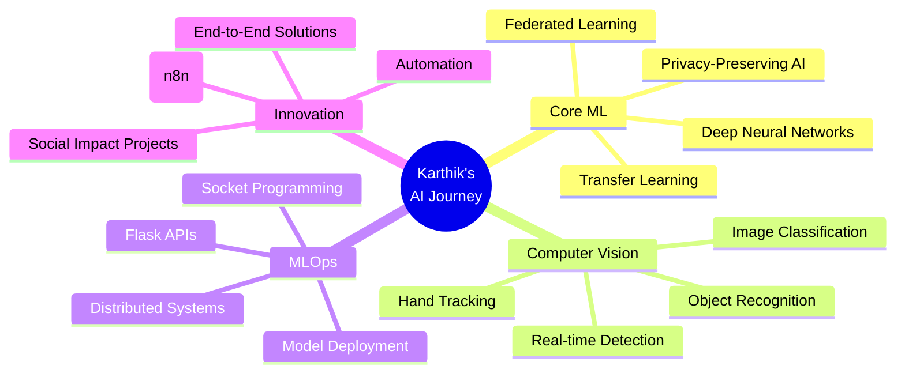
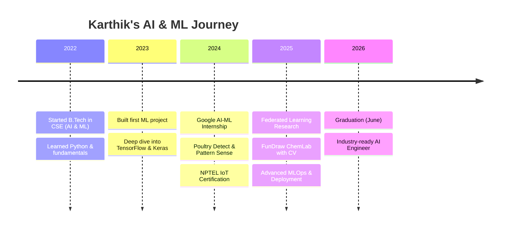

<div align="center">
  
# 👋 Hi there! I'm Karthik Reddy Manchala


<p align="center">
  
</p>

[](https://github.com/karthikredddy7github)
[](https://github.com/karthikredddy7github?tab=followers)
[](https://github.com/karthikredddy7github?tab=repositories)

</div>

---

## 🚀 About Me

```python
class KarthikReddyManchala:
    def __init__(self):
        self.name = "Karthik Reddy Manchala"
        self.role = "AI & ML Engineer | Deep Learning Enthusiast"
        self.education = {
            "degree": "B.Tech Computer Science (AI & ML Specialization)",
            "institution": "RISE Krishna Sai Prakasam Group of Institutions",
            "cgpa": "9.15/10",
            "graduation": "June 2026"
        }
        self.location = "Ongole, Andhra Pradesh, India"
        self.current_focus = [
            "Federated Learning & Privacy-Preserving AI",
            "AI Agent Development (n8n)",
            "MLOps & Model Deployment",
            "Computer Vision Applications"
        ]
        self.passion = "Building end-to-end ML solutions that solve real-world problems"
    
    def say_hi(self):
        print("Thanks for stopping by! Let's build something amazing together! 🚀")

me = KarthikReddyManchala()
me.say_hi()
```

<div align="center">

### 🎯 Quick Highlights

🎓 **9.15 CGPA** | 🏆 **Google AI-ML Certified** | 🔬 **Federated Learning Researcher** | 💡 **3+ ML Projects Deployed**

</div>

---

## 🏆 GitHub Trophies

<div align="center">
  
</div>

---

## 🔥 Featured Projects

<div align="center">

### 🌊 [Flood Forecasting Using Federated Learning](https://github.com/karthikredddy7github/Flood_Forecasting_Model_using_Federated-Learning)
**🏅 Privacy-Preserving Distributed Deep Learning for Flood Prediction**


%200.90-brightgreen?style=for-the-badge" />


</div>

```yaml
Core Innovation: Privacy-preserving flood forecasting without sharing sensitive hydrological data
Architecture: 3 distributed monitoring stations + Central aggregation server
Models: 
  - FFNN (baseline): Feed-forward neural network
  - CNN-2D (advanced): 2D Convolutional neural network
Algorithm: Federated Averaging (FedAvg)
Communication: TCP/IP socket-based (Port 2222)
Key Metrics:
  - R² Score: >0.90
  - MSE: Optimized through federated training
  - Privacy: 100% data locality preserved
Tech Stack: TensorFlow, Keras, Python Sockets, CustomTkinter, Matplotlib, NumPy
Impact: Early warning system protecting communities while preserving data privacy
```

**✨ Key Features:**
- 🔐 **Privacy-First**: Raw data never leaves local stations
- 🧠 **Dual Architecture**: FFNN + CNN-2D models
- 📊 **Real-time Dashboards**: Live training visualization
- 🌐 **Distributed Design**: Server + 3 Client Stations
- 🔄 **FedAvg Algorithm**: Standard federated averaging
- 📈 **Comprehensive Metrics**: MSE, RMSE, R², Accuracy
- 🎨 **Modern UI**: Tkinter + CustomTkinter with dark mode
- 📄 **Auto-Reporting**: PDF generation for summaries

---

<div align="center">

### 🎨🧪 [FunDraw ChemLab - AI Virtual Painter](https://github.com/karthikredddy7github/FunDraw_ChemLab)
**🖐️ Touchless Canvas Using Hand Gestures & Virtual Chemistry Lab**


</div>

```yaml
Innovation: Turn your webcam into a touchless canvas using hand tracking
Features:
  - Virtual Painter: Draw in air using hand gestures
  - Chemistry Lab: Interactive virtual chemistry experiments
  - Real-time Detection: Hand landmark tracking with MediaPipe
Tech Stack: Python, OpenCV, MediaPipe, NumPy
Applications: Education, Interactive Art, Accessibility Tools
```

**✨ Capabilities:**
- ✋ **Hand Tracking**: Real-time 21-landmark hand detection
- 🎨 **Virtual Drawing**: Paint in air with finger gestures
- 🧪 **Chemistry Simulations**: Interactive virtual lab experiments
- 📹 **Webcam-Based**: No special hardware required
- 🎯 **Educational**: Fun learning tool for students

---

<div align="center">

### 🐔 [Poultry Detect - AI Disease Detection](https://github.com/karthikredddy7github/Poultry_disease_detect-AI)
**🌾 Empowering Rural Farmers with AI-Powered Disease Detection**


</div>

```yaml
Problem: Early disease detection critical for poultry farming
Solution: CNN-based web app for instant disease classification
Diseases Detected:
  - Coccidiosis
  - Newcastle Disease
  - Salmonella
Tech Stack: Python, TensorFlow, Flask, HTML/CSS
Deployment: Web-based for accessibility
Impact: Early detection saves livestock and farmer livelihoods
```

---

<div align="center">

### 🎨 [Pattern Sense - Fabric Classifier](https://github.com/karthikredddy7github/pattern_sense)
**👗 Deep Learning for Textile Industry**


</div>

```yaml
Innovation: Automated fabric pattern classification for fashion industry
Model: MobileNetV2 (Transfer Learning)
Categories: [Animal, Cartoon, Floral, Geometry, Ikat, Plain, 
             Polka Dot, Squares, Stripes, Tribal]
Application: Fashion designers, Quality assurance teams
Tech Stack: MobileNetV2, TensorFlow, Flask, Python
Benefits: Faster design workflows, automated inventory management
```

---

## 💻 Tech Stack & Skills

<div align="center">

### 🧠 AI/ML & Deep Learning


### 🌐 Web Development


### 💾 Programming Languages


### 🛠️ Tools & Platforms


### 🤖 AI Development Tools


### 🔧 Specialized Skills


</div>

---

## 📊 GitHub Analytics

<div align="center">
  
  
</div>

<div align="center">
  
</div>

<div align="center">
  
</div>

---

## 🏆 Achievements & Certifications

<div align="center">

| Certification | Issuer | Date | Area |
|---------------|--------|------|------|
| 🤖 **Google AI-ML Virtual Internship** | EduSkills | Jul-Sep 2024 | Machine Learning |
| 🎓 **TECH CAMP on Google AI-ML** | EduSkills | Aug 2024 | Deep Learning |
| 🌐 **Introduction to IoT** | NPTEL | 2024 | IoT Systems |
| 💬 **Prompt Engineering & ChatGPT** | ExcelR & APSCHE | 2024 | Generative AI |

</div>

---

## 🎯 Research & Focus Areas

<div align="center">



</div>

### 🔬 Current Research Interests

- 🔐 **Federated Learning**: Privacy-preserving distributed machine learning
- 🌊 **Computational Hydro-Informatics**: AI for environmental monitoring
- 🤖 **AI Agent Development**: Automation workflows using n8n
- 📊 **MLOps**: Scalable model deployment and monitoring
- 👁️ **Computer Vision**: Real-time image & video analysis
- 🧠 **Deep Learning Architectures**: CNN, RNN, LSTM, Transformers
- 🔄 **Transfer Learning**: Leveraging pre-trained models efficiently

---

## 📈 Coding Stats

<div align="center">

<!--START_SECTION:waka-->


<!--END_SECTION:waka-->

</div>

---

## 🌟 Professional Journey



---

## 📫 Connect With Me

<div align="center">

[](mailto:karthikreddym4253@gmail.com)
[](https://github.com/karthikredddy7github)
[](https://leetcode.com/u/Karthik_reddy_manchala)
[](#)

</div>

---

## 💼 Open for Opportunities

🔍 **Actively seeking:**
- 🎓 Graduate positions in AI/ML Engineering
- 🔬 Research internships in Federated Learning
- 💻 Full-time roles in Deep Learning & Computer Vision
- 🚀 Collaborative projects on privacy-preserving AI

---

## 💡 Fun Facts

- 🌊 Built a federated learning system from scratch (socket programming + deep learning)
- ✋ Created an AI that lets you paint in the air with your hands
- 🐔 Helping rural farmers detect poultry diseases early
- 🎨 Automated fabric pattern recognition for the fashion industry
- 📚 Constant learner - always exploring cutting-edge AI research papers
- 🎯 Believer in **AI for Social Good**

---


---

<div align="center">

### ⚡ Profile Stats Summary


</div>

---

<div align="center">


### ✨ *"Building the future with AI, one project at a time"* ✨

**Let's collaborate and create something amazing! 🚀**


</div>
